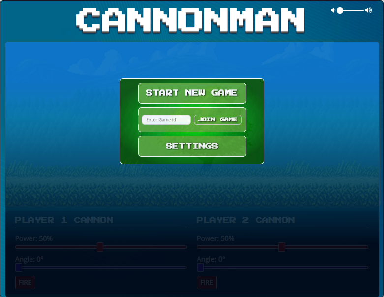

# Cannon-Game

Cannon Man is a fun and exciting 2 player shooting game inspired by the classic Flash game Bowman. The object of the game is to be the first one to shoot down your opponents cannon and you win. This game was built as a school project to further increase experience with jQuery, bootstrap, Matter.js, Firebase, and Jasmine. [Play the official game here!](https://ltbackup.github.io/Cannon-Game/)

### Screenshot

  

## Getting Started

These instructions will get you a copy of the project up and running on your local machine for development and testing purposes. See deployment for notes on how to deploy the project on a live system.

1. Within GitHub, navigate to the main page of the repository.

2. Click the Clone or download button.

3. Copy the clone URL for the repository.

4. Open Terminal or CMD Prompt(Windows).

5. Change your current working directory to the location where you'd like the cloned directory be stored.

6. Type git clone, and then paste the URL you copied in Step 3.

7. git clone https://github.com/LtBackup/Cannon-Game.git

8. Press Enter and a new local cloned repository will be created. 

### Browser support

| Chrome | 
| --- | 
| 24+ | 

## Running the tests

Open `jasmine-testing/SpecRunner.html` in browser

## Deployment

Add additional notes about how to deploy this on a live system

## Built With

* [Matter.js](http://brm.io/matter-js/) - A 2d rigid body JS physics engine used for animation
* [Firebase](https://rometools.github.io/rome/) - Realtime database for multiplayer functionality
* [Bootstrap](http://www.dropwizard.io/1.0.2/docs/) - CSS library
* [jQuery](https://maven.apache.org/) - Library used for DOM manipulation
* [Jasmine](https://rometools.github.io/rome/) - Testing framework for unit tests

## Authors

* **Jim Pratt** - [GitHub](https://github.com/ltBackup)
* **Mina Slater** - [GitHub](https://github.com/minaslater)
* **Natraj Subramanian** - [GitHub](https://github.com/natraj-s)
* **Efosa Ogiesoba** - [GitHub](https://github.com/eogiesoba)

## License

Matter.js is licensed under the MIT License - see the [LICENSE.md](LICENSE.md) file for details

## Acknowledgments

* Hat tip to anyone whose code was used
* Inspired by [Bowman](http://www.crazygames.com/game/bowman-2)
